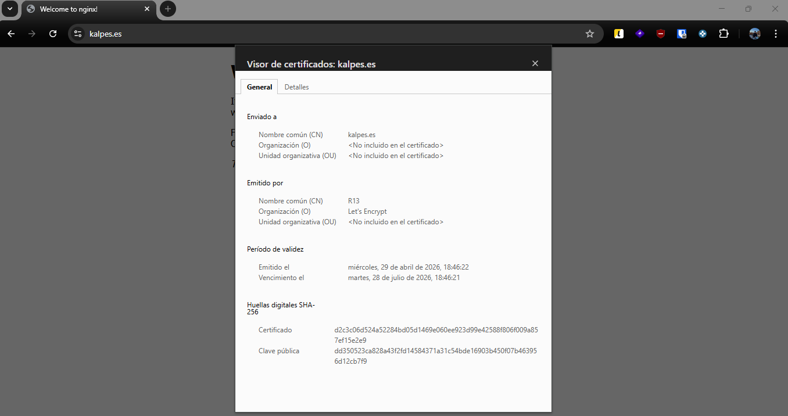
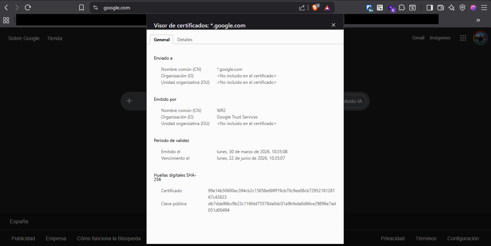

# Proyecto 9 - Parte 2: Análisis y Comparativa de Certificados Digitales (Vía Realista)

**Alumno:** Pablo Gonzalez
**Dominio del proyecto:** kalpes.es

A continuación, se presentan los datos del certificado digital generado para el servidor propio mediante Let's Encrypt, en comparación con el certificado de un sitio web verificado de gran escala (google.com).

## 1. Certificado del servidor propio (kalpes.es)

**Datos extraídos del certificado:**

- **Nombre común (CN) del sujeto:** `kalpes.es`
- **Nombre común (CN) del emisor:** `R13`
- **Organización (O) del emisor:** `Let's Encrypt`
- **Emitido el:** Miércoles, 29 de abril de 2026, 18:46:22
- **Vencimiento el:** Martes, 28 de julio de 2026, 18:46:21
- **Huella digital (Certificado):** `d2c3c06d524a52284bd05d1469e060ee923d99e42588f806f009a857ef15e2e9`

---

## 2. Certificado del sitio web verificado (google.com)

**Datos extraídos del certificado:**

- **Nombre común (CN) del sujeto:** `*.google.com`
- **Nombre común (CN) del emisor:** `WR2`
- **Organización (O) del emisor:** `Google Trust Services`
- **Emitido el:** Lunes, 30 de marzo de 2026, 10:35:08
- **Vencimiento el:** Lunes, 22 de junio de 2026, 10:35:07
- **Huella digital (Certificado):** `99e14b50600ec394cb2c15858e68fff19cb70c9ee08cb7295218128167c43823`

---

## 3. Análisis y Comparativa

Al analizar los datos de ambos certificados, podemos observar varias similitudes propias de los estándares de seguridad actuales, así como diferencias clave derivadas de la naturaleza de cada proyecto:

### A. Autoridad de Certificación (CA) Emisora

- **Mi servidor:** Utiliza **Let's Encrypt**, una autoridad de certificación gratuita, automatizada y abierta. Es el estándar actual para la mayoría de sitios web que buscan implementar HTTPS de forma accesible mediante el protocolo ACME (en este caso, usando Certbot).
- **Google:** Utiliza **Google Trust Services**. Al ser un gigante tecnológico, Google actúa como su propia Autoridad de Certificación. Esto les da un control total sobre la emisión, revocación y gestión de toda la cadena de confianza de sus servicios.

### B. Nombre Común (CN) y Alcance

- **Mi servidor (`kalpes.es`):** Es un certificado específico emitido para el dominio exacto y su variante con _www_.
- **Google (`*.google.com`):** Es un certificado **Wildcard (comodín)**. El asterisco indica que el certificado es válido para cualquier subdominio de primer nivel (como _mail.google.com_, _drive.google.com_, etc.). Esto es vital para empresas con multitud de servicios bajo un mismo dominio, ya que evita tener que generar y gestionar miles de certificados individuales.

### C. Periodo de Validez

- **Similitud:** Ambos certificados tienen una vida útil muy corta. El de Let's Encrypt dura exactamente **90 días**, y el de Google dura aproximadamente **84 días**.
- **Motivo:** Antiguamente los certificados duraban años, pero la industria ha reducido drásticamente este tiempo para minimizar el riesgo en caso de que una clave privada sea comprometida. Obliga a utilizar sistemas de renovación automática (como la tarea _cron_ que instaló Certbot en el servidor).

### D. Tipo de Validación

- En ambos casos, el campo Organización (O) del sujeto aparece como `<No incluido en el certificado>`. Esto nos indica que, a nivel visible, se trata de certificados de **Validación de Dominio (DV)**. El emisor solo certifica que el solicitante tiene control técnico sobre el dominio, pero no incluye datos legales de la empresa en el propio certificado (como sí harían los certificados OV de Validación de Organización o EV de Validación Extendida).
