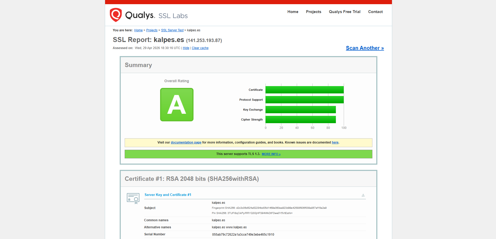
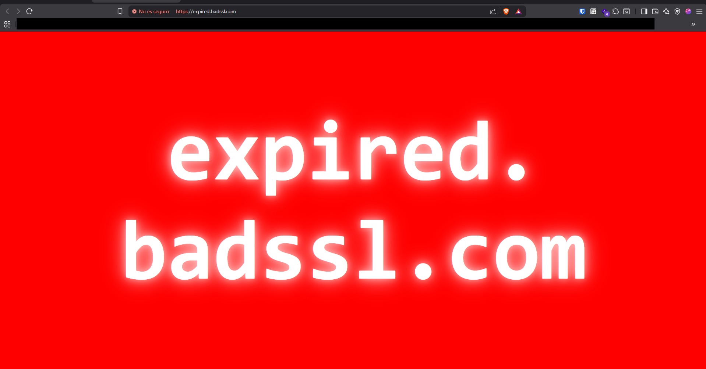
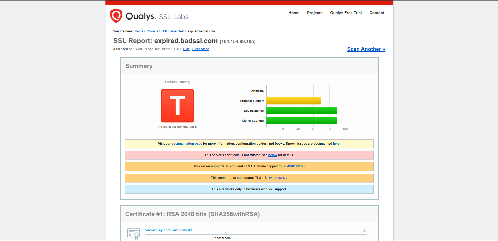
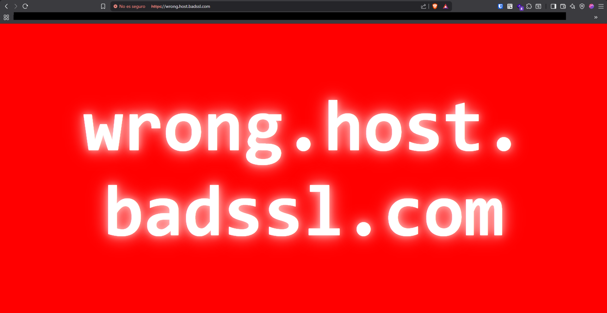
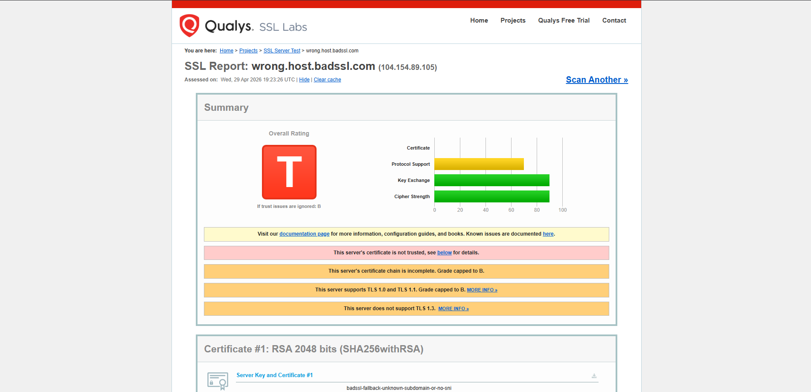
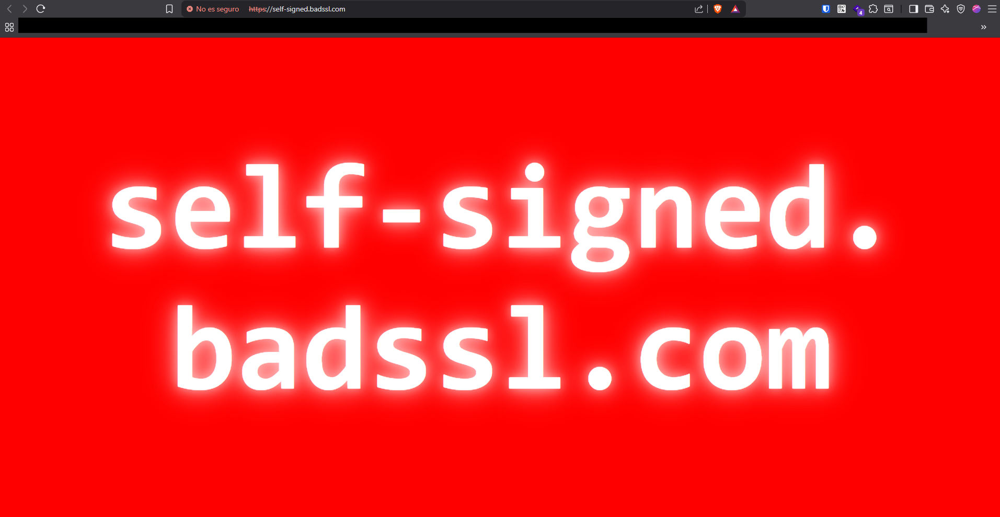
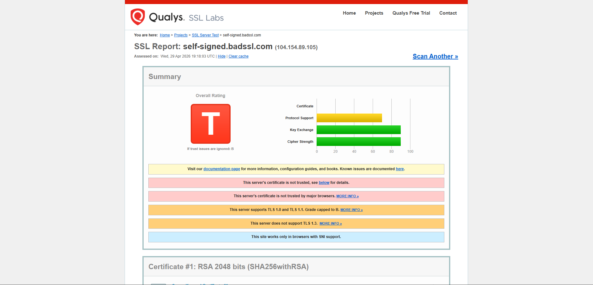

# Proyecto 9 - Parte 3: Verificación y Análisis de Certificados Digitales

**Alumno:** Pablo Gonzalez
**Dominio del proyecto:** kalpes.es

## 1. Análisis de un Certificado Válido (Mi servidor)

Se ha utilizado la herramienta **Qualys SSL Labs** para comprobar la solidez y configuración del certificado de mi servidor web realista (`kalpes.es`).

**Análisis de los resultados (Nota: A)**
El servicio califica el certificado como válido y altamente seguro por los siguientes motivos técnicos:

1. **Confianza de la Autoridad (Trusted):** El certificado está emitido por _Let's Encrypt_ (R13), cuya raíz (ISRG Root X1) está instalada por defecto en los almacenes de confianza de todos los navegadores y sistemas operativos modernos (Mozilla, Apple, Android, Windows).
2. **Soporte de Protocolos Modernos:** El servidor tiene habilitados únicamente TLS 1.2 y el rapidísimo **TLS 1.3**. Al mismo tiempo, bloquea conexiones obsoletas e inseguras como SSLv2, SSLv3, TLS 1.0 y TLS 1.1.
3. **Resistencia a vulnerabilidades:** El reporte confirma que el servidor no es vulnerable a ataques conocidos como Heartbleed, POODLE, BEAST o ROBOT.
4. **Forward Secrecy (Secreto Perfecto Hacia Adelante):** Está activado de forma robusta, lo que significa que si en el futuro alguien robara la clave privada del servidor, no podría descifrar las conversaciones pasadas que hayan sido capturadas.

---

## 2. Análisis de Certificados Inválidos

Para demostrar las diferentes casuísticas por las que un navegador rechaza una conexión HTTPS, se han analizado tres sitios web de pruebas (proporcionados por _badssl.com_) que contienen certificados erróneos por diferentes motivos.

### A. Certificado Caducado (Expired)

- **Motivo de la invalidez:** El ciclo de vida del certificado ha terminado. La fecha actual es superior a la fecha marcada en el campo "Válido hasta" (Valid until) del certificado. Los navegadores bloquean el acceso porque un certificado caducado significa que la identidad de la web ya no está siendo validada activamente por la Autoridad de Certificación, pudiendo haber cambiado de dueño.

### B. Nombre de Dominio Incorrecto (Wrong Host)

- **Motivo de la invalidez:** El certificado en sí mismo es válido y no ha caducado, pero el campo **Nombre Común (CN)** o los _Nombres Alternativos del Sujeto (SAN)_ no coinciden con la URL que se está escribiendo en el navegador. Es una medida de seguridad vital contra ataques _Man-in-the-Middle_, garantizando que el certificado que recibes pertenece exactamente al dominio que solicitaste y no a otro distinto alojado en el mismo servidor.

### C. Certificado Autofirmado (Self-Signed)

- **Motivo de la invalidez:** Aunque la conexión está técnicamente cifrada, el certificado ha sido generado y firmado por el propio dueño del servidor, no por una Autoridad de Certificación (CA) oficial. Al no haber un "tercero de confianza" que valide quién es realmente el creador, el navegador lanza una advertencia de seguridad severa, ya que cualquier atacante puede crear un certificado autofirmado con datos falsos.
