# 1. Documentación de Instalación y Configuración

## 1.1. Preparación del Entorno y Red

Para garantizar la comunicación aislada y estática entre el SIEM y el agente, se procedió a crear una red tipo bridge en Docker con una subred específica (`172.20.0.0/24`). Además, debido a los requerimientos de Elasticsearch en entornos Windows/WSL2, se aumentó el límite de memoria virtual (`vm.max_map_count=262144`).

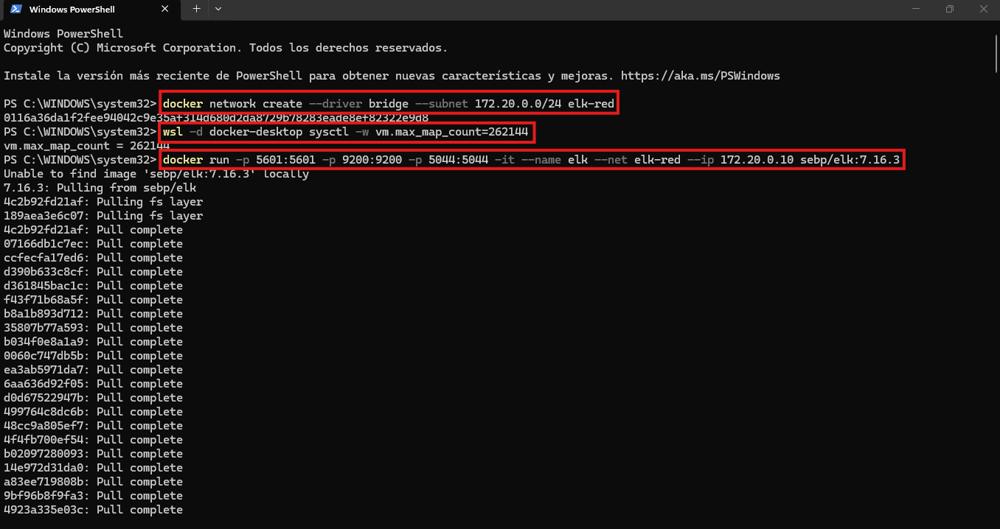

## 1.2. Despliegue del SIEM (ELK Stack)

Se descargó e instanció la imagen `sebp/elk:7.16.3` asignándole la IP fija `172.20.0.10`. Para facilitar el entorno de pruebas y evitar conflictos de certificados, se accedió al contenedor para deshabilitar el protocolo SSL en el input de Logstash (`/etc/logstash/conf.d/02-beats-input.conf`).

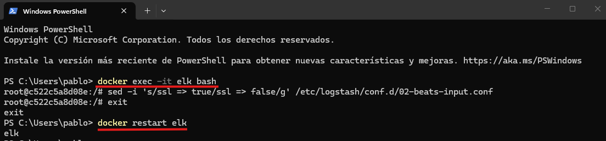
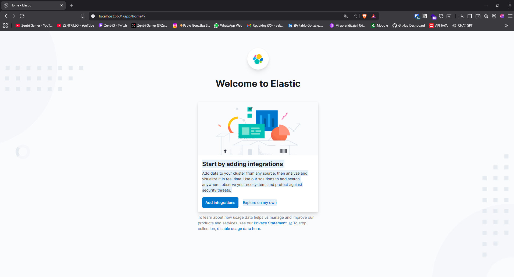

## 1.3. Preparación del Agente (Contenedor Víctima)

Para el agente emisor de logs, se descargó el repositorio base desde GitHub que incluye un servidor Nginx monitorizado por Filebeat.

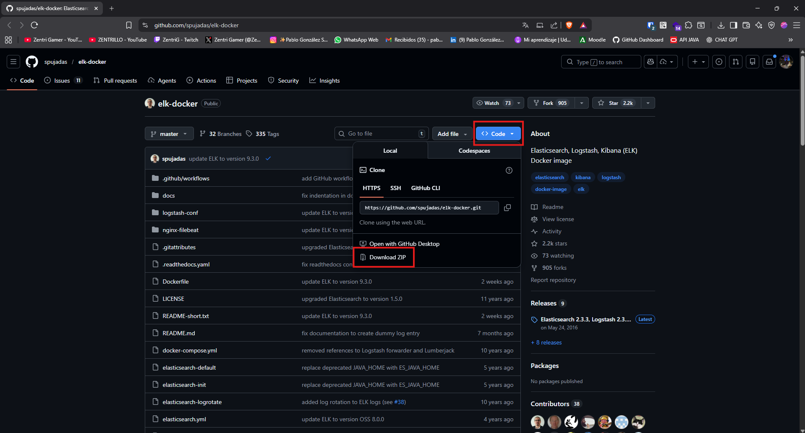

### 1.3.1. Solución de Problemas (Troubleshooting) de Configuración y Versiones

Al revisar los archivos originales de configuración ([Ver filebeat original](docs/5.filebeat1.txt) y [Ver Dockerfile original](docs/7.dockerfile1.txt)), se detectaron incompatibilidades graves:

1. **Versiones obsoletas y conflictos:** El `Dockerfile` contenía errores de _merge_ de Git y apuntaba a repositorios de Debian caducados que impedían la instalación de paquetes.
2. **Ausencia del IDS:** La imagen base moderna de Nginx ya no incluye Snort en sus repositorios oficiales.

**Solución aplicada:**
Se reescribió el archivo de configuración de Filebeat para apuntar a nuestro Logstash sin SSL ([Ver nuevo filebeat](docs/6.filebeat2.txt)). Además, se modificó el `Dockerfile` bajando la versión a `nginx:1.18` (Debian Buster), reescribiendo los orígenes hacia `archive.debian.org` y forzando la instalación automatizada de `snort` y `nano` (`DEBIAN_FRONTEND=noninteractive`).
[Ver Dockerfile corregido](docs/8.dockerfile2.txt).

### 1.3.2. Construcción y Ejecución

Con los archivos corregidos, se construyó la imagen personalizada y se levantó el contenedor `filebeat` uniéndolo a la red `elk-red`.

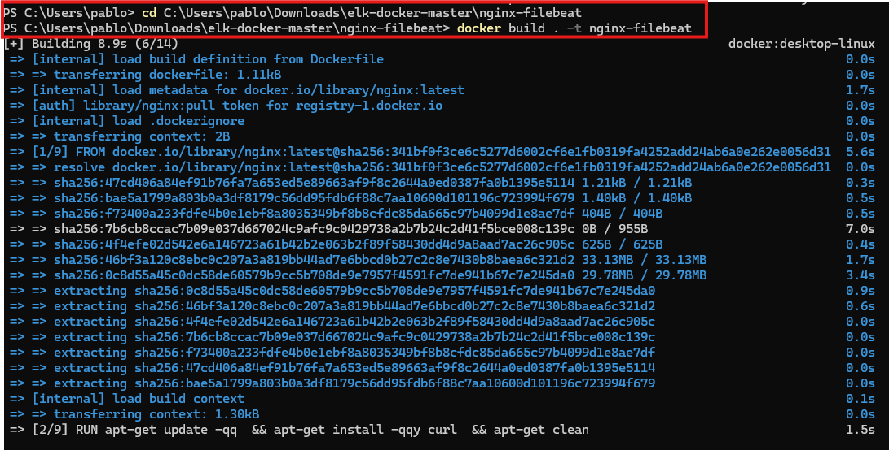
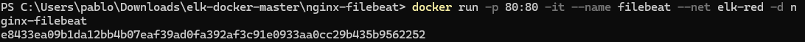
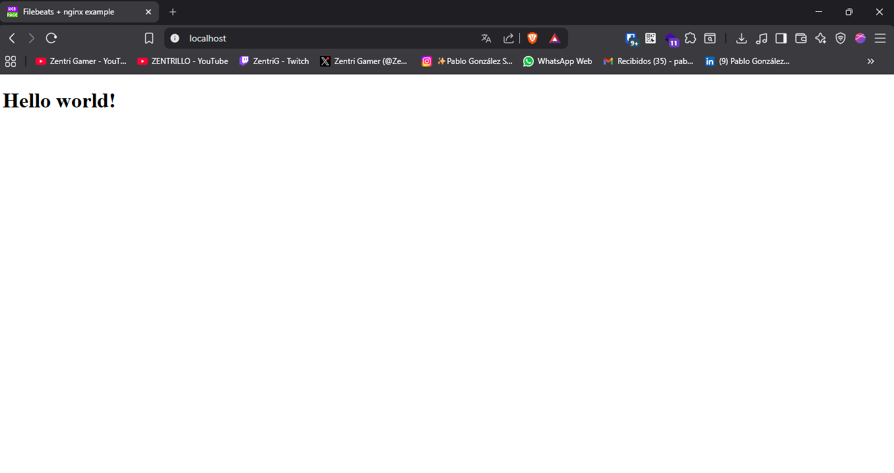

## 1.4. Configuración Inicial en Kibana

Una vez levantada la infraestructura, se accedió a la interfaz web de Kibana (`http://localhost:5601`) para configurar la ingesta de datos. Se accedió a la sección de _Index Patterns_ y se creó el patrón `filebeat-*` asociado al campo de tiempo `@timestamp`.

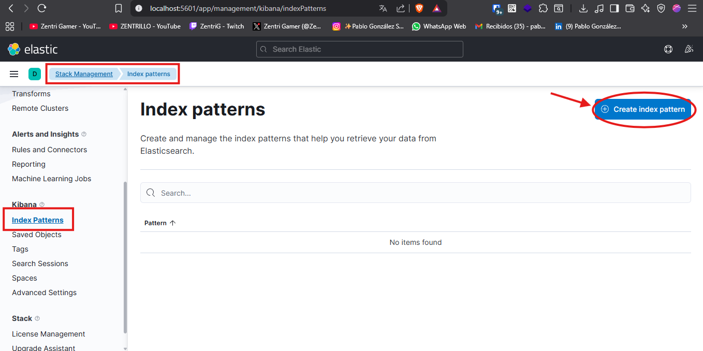
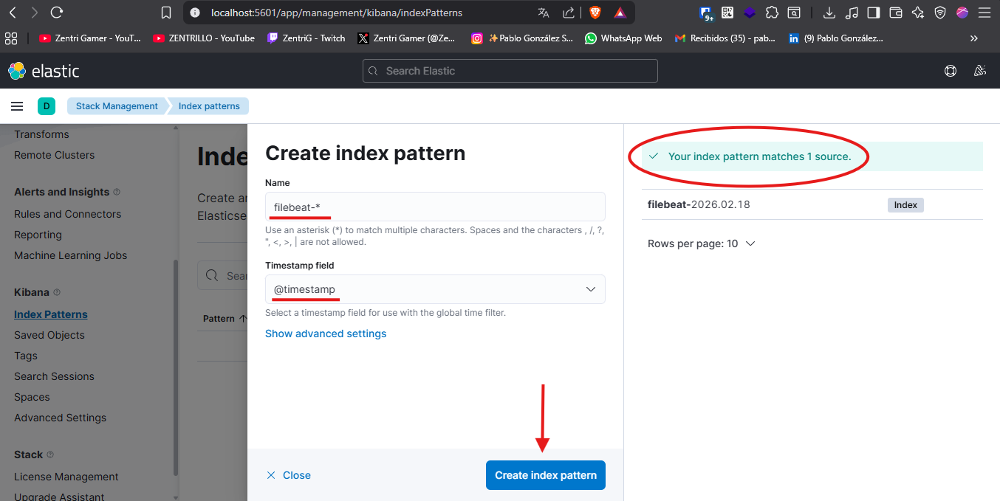
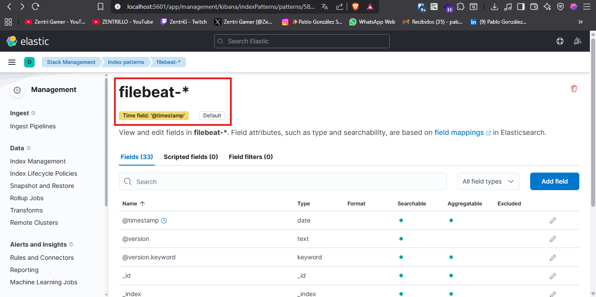

Para comprobar el correcto flujo de los datos, se generó tráfico web visitando `http://localhost`, lo cual se reflejó exitosamente en el apartado Discover de Kibana.

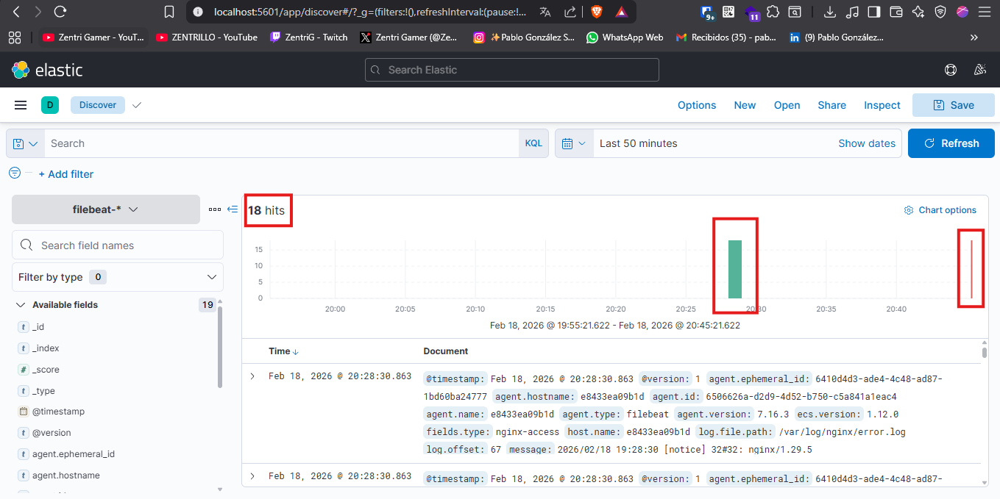
