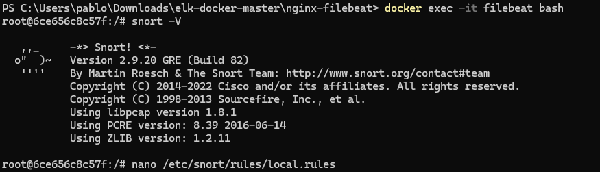
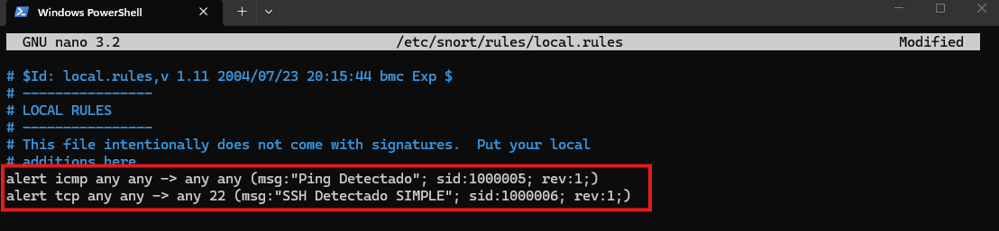
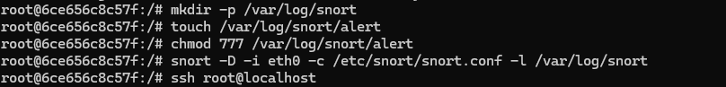
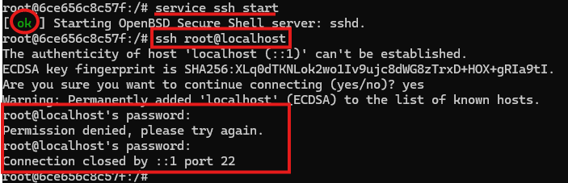
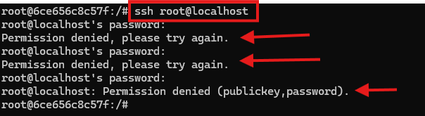
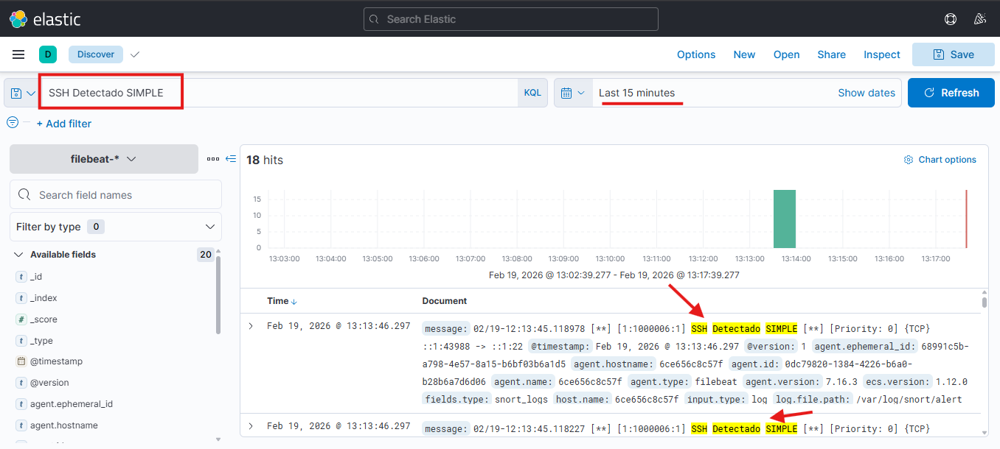

# 3. Implementación y Pruebas del Caso de Uso

## 3.1. Configuración del IDS (Snort) y Reglas de Detección

Para implementar el caso de uso diseñado, primero se comprobó que Snort estuviera correctamente instalado en el contenedor víctima.

A continuación, se editaron las reglas locales de Snort (`/etc/snort/rules/local.rules`). Se añadieron directivas específicas para la detección de escaneos ICMP y la identificación de tráfico hacia el puerto 22, utilizando reglas simplificadas para garantizar la captura en la interfaz de loopback (`lo`).

## 3.2. Integración de Snort con Filebeat (SIEM)

Para centralizar las alertas, era imperativo que Filebeat monitorizara el output generado por el IDS. Se añadió un nuevo bloque `input` en `/etc/filebeat/filebeat.yml` definiendo la ruta estandarizada de las alertas de Snort.
[Ver configuración final de Filebeat](docs/18.filebeat3.txt).

Se prepararon las carpetas de destino necesarias para que Snort pudiera ejecutar su registro en modo demonio de forma segura sin problemas de permisos.

## 3.3. Simulación del Ataque (ICMP y SSH Fuerza Bruta)

Con el agente Filebeat reiniciado y Snort vigilando el tráfico (`snort -A fast -D -i lo -c /etc/snort/snort.conf -l /var/log/snort -k none`), se iniciaron los ataques.

Se procedió a simular una intrusión por fuerza bruta invocando el cliente SSH local contra el servidor interno, generando múltiples fallos de contraseña deliberados para replicar un ataque de diccionario.

Tras el cese del ataque, se comprobó localmente el archivo de alertas. Tal y como estaba previsto en el flujo lógico, Snort identificó los intentos y volcó las alertas `[**] [1:1000006:1] SSH Detectado SIMPLE [**]` en el fichero físico.

## 3.4. Confirmación de Recepción en el SIEM

El objetivo final de la práctica consistía en visualizar el evento en el cuadro de mandos del SOC. Se accedió a la consola Kibana y se filtró la ingesta reciente del índice `filebeat-*` buscando la cadena "SSH Detectado".

La recolección de eventos funcionó con éxito, mostrando claramente la alerta tipificada e importando el contenido exacto de los logs de Snort al SIEM, cumpliendo así con los requisitos del caso de uso.

