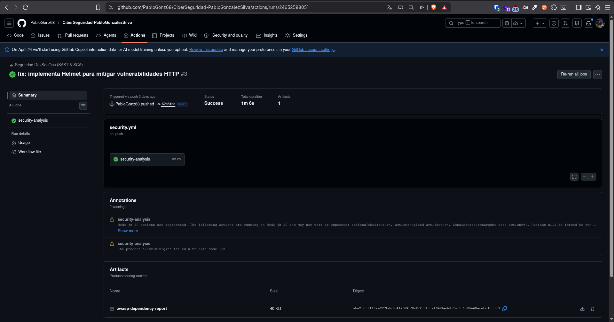
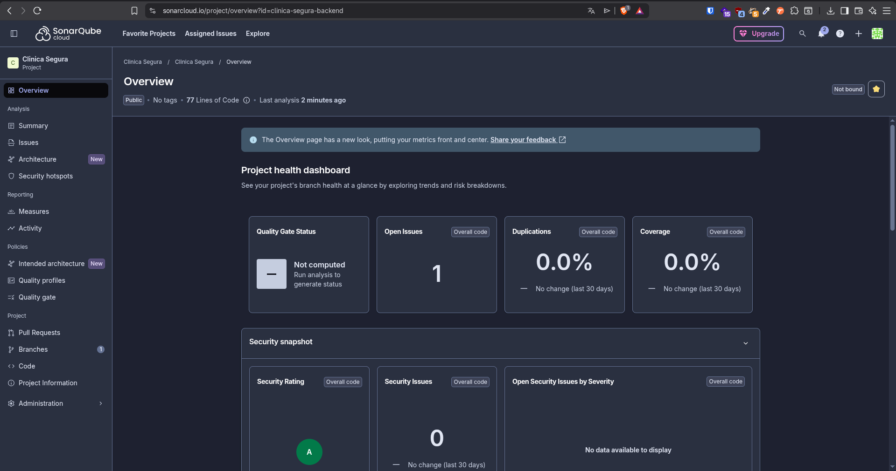
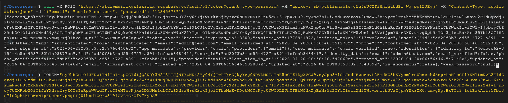
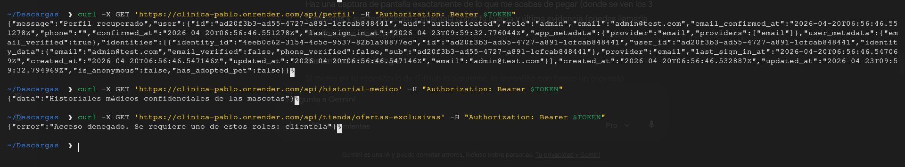
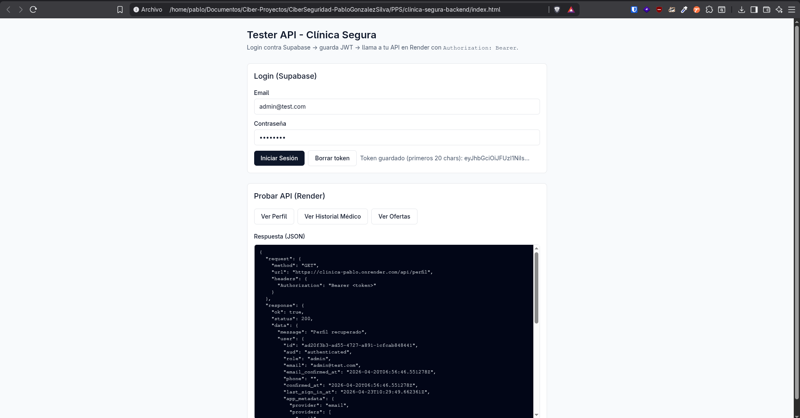

# Clínica Segura API - DevSecOps & Security Project

Este proyecto implementa el backend de una API REST para la gestión de una clínica veterinaria ("Clínica Segura"), diseñada bajo el paradigma **DevSecOps** y cumpliendo estrictamente con altos estándares de ciberseguridad.

El objetivo principal es demostrar la implementación de arquitecturas seguras, control de acceso granular, automatización de pruebas de seguridad (CI/CD) y fortificación de despliegues en la nube.

---

##  Requisitos Cumplidos

A continuación, se detalla la implementación de cada uno de los requisitos del proyecto:

### 1. Autenticación OAuth 2 y JWT
Se ha integrado **Supabase** como proveedor de identidad (IdP). La API no gestiona contraseñas directamente; en su lugar, delega la autenticación a Supabase (que soporta flujos OAuth 2) y valida tokens JWT en cada petición HTTP mediante un middleware personalizado (`checkAuth`).

### 2. Gestión de Autorización: RBAC y ABAC
El control de acceso está diseñado en dos capas dentro de la ruta de la API:
* **RBAC (Role-Based Access Control):** Implementado mediante el middleware `authorizeRole`. Limita el acceso a endpoints sensibles (como `/api/historial-medico`) exclusivamente a usuarios con el rol `admin` o `veterinario`.
* **ABAC (Attribute-Based Access Control):** Implementado mediante el middleware `checkAdoptionBenefit`. Evalúa de forma dinámica los atributos del usuario (en este caso, el booleano `has_adopted_pet`). Si un usuario tiene el rol `clientela` pero no ha adoptado una mascota, se le deniega el acceso a las ofertas exclusivas (`/api/tienda/ofertas-exclusivas`).

### 3. Integración DevSecOps: Pipeline CI/CD en GitHub Actions
Se ha automatizado la seguridad integrando escáneres directamente en el ciclo de vida del desarrollo (`.github/workflows/security.yml`). Cada `git push` a la rama principal dispara un entorno virtual que ejecuta los análisis de seguridad.

* **SAST (Static Application Security Testing):** Análisis estático de código fuente utilizando **SonarCloud (SonarQube)** para detectar vulnerabilidades lógicas, *code smells* y fugas de seguridad escritas en el código TypeScript.

  

* **SCA / Análisis RCA (Software Composition Analysis):** Implementación de **OWASP Dependency Check** para analizar el archivo `package.json` en busca de vulnerabilidades conocidas (CVEs) en las librerías de terceros. 
  * 📄 *El informe detallado se ha generado automáticamente y está disponible en: [`./utils/2.dependency-check-report.html`](./utils/2.dependency-check-report.html)*

### 4. Análisis DAST (Dynamic Application Security Testing)
Con la aplicación desplegada, se ha ejecutado un escaneo dinámico de "caja negra" utilizando **OWASP ZAP**. 
* **Mitigación aplicada:** Tras el análisis DAST, se detectaron vulnerabilidades de configuración HTTP (como la exposición del framework con `X-Powered-By` y la falta de cabeceras estrictas). Se han mitigado en el código implementando la librería **Helmet**, fortificando las cabeceras HTTP (`Strict-Transport-Security`, `X-Content-Type-Options: nosniff`, etc.).
  * 📄 *El informe detallado del escaneo dinámico está disponible en: [`./utils/4.zap-report.html`](./utils/4.zap-report.html)*

### 5. Despliegue en la Nube (Render + Supabase)
La infraestructura está dividida y desplegada en servicios Cloud:
* **Base de Datos y Auth:** Alojado en **Supabase** (PostgreSQL con Row Level Security activo).
* **API Backend:** Desplegado como Web Service en **Render.com**. Se ejecuta bajo un entorno Node.js utilizando el comando de arranque de producción.

### 6. Gestión de Secretos
Se ha aplicado el principio de mínimo privilegio y ocultación de credenciales en todos los entornos:
* **Entorno CI/CD:** El token de SonarCloud (`SONAR_TOKEN`) está cifrado utilizando **GitHub Secrets**, evitando su exposición en el archivo `security.yml`.
* **Entorno de Producción:** Las credenciales de base de datos (`SUPABASE_URL` y `SUPABASE_KEY`) están inyectadas de forma segura a través del gestor de **Environment Variables de Render**, permitiendo que el código se ejecute sin contener secretos en texto plano.

---

## 📸 Evidencias de Funcionamiento y Pruebas

Para demostrar el correcto funcionamiento de la seguridad perimetral, la autenticación JWT y los bloqueos por RBAC/ABAC, se han realizado pruebas exhaustivas:

**1. Obtención del token OAuth 2 (Supabase) desde la terminal:**

**2. Pruebas de acceso a la API (Resolución de RBAC y ABAC):**
*Se observa cómo el middleware permite el acceso al perfil, pero bloquea las rutas no autorizadas según el rol y los atributos del usuario.*

**3. Frontend Web de Pruebas:**
*Se ha desarrollado un cliente web (Frontend) opcional para interactuar visualmente con la API segura y comprobar el flujo completo de autenticación y autorización.*

---

## 🚀 Endpoints de la API

La API base se encuentra desplegada en: `https://clinica-pablo.onrender.com`

| Método | Endpoint | Autenticación | Autorización (Reglas) |
| :--- | :--- | :--- | :--- |
| `GET` | `/api/health` | Pública | Ninguna |
| `GET` | `/api/perfil` | JWT Requerido | Cualquier usuario autenticado |
| `GET` | `/api/historial-medico` | JWT Requerido | **RBAC:** Solo `admin`, `veterinario` |
| `GET` | `/api/tienda/ofertas-exclusivas` | JWT Requerido | **RBAC:** `clientela` + **ABAC:** `has_adopted_pet = true` |

---

## 🛠️ Stack Tecnológico

* **Backend:** Node.js, Express, TypeScript.
* **Seguridad API:** Helmet, CORS, JWT Auth.
* **Base de Datos:** Supabase (PostgreSQL).
* **DevSecOps:** GitHub Actions, SonarCloud, OWASP Dependency Check, OWASP ZAP.
* **Hosting:** Render.com

---

*Proyecto desarrollado para la evaluación práctica de arquitecturas seguras y DevSecOps.*