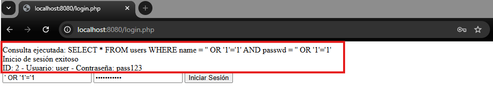
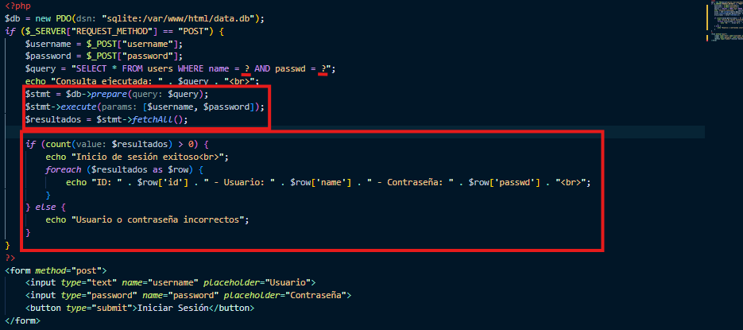
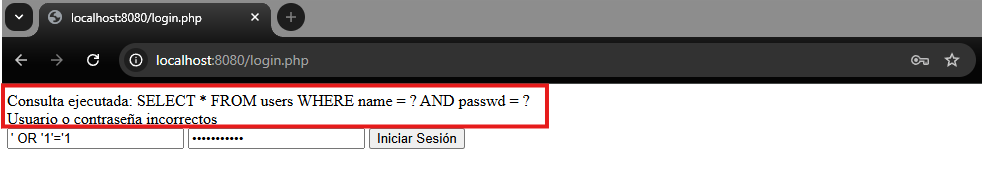

# Informe de Actividad: Vulnerabilidades OWASP Top 10 - Inyección SQL

**Objetivo:** Demostrar la explotación y posterior mitigación de una vulnerabilidad de Inyección SQL (SQLi) en un entorno de pruebas local.

---

## 1. Explotación de la Vulnerabilidad (El Ataque)

El aplicativo inicial presentaba un formulario de inicio de sesión (`login.php`) vulnerable a Inyección SQL debido a la falta de sanitización en las entradas del usuario.

Para explotar la vulnerabilidad, se introdujo el siguiente _payload_ tanto en el campo de usuario como en el de contraseña:

Campo de usuario y contraseña:

```
' OR '1'='1
```

Al procesar la petición, la consulta a la base de datos resultante fue:

```sql
SELECT * FROM users WHERE name = '' OR '1'='1' AND passwd = '' OR '1'='1'
```

Como la condición `1=1` siempre se evalúa como verdadera (`TRUE`), el motor de la base de datos ignoró la autenticación original y devolvió todos los registros de la tabla `users`. Esto permitió eludir el inicio de sesión y expuso datos sensibles.

### Evidencia de la explotación



---

## 2. Análisis del Código y Mitigación (El Parche)

### Origen del fallo

El código vulnerable concatenaba directamente las variables `$username` y `$password` obtenidas del método `POST` en la cadena de la consulta SQL:

```php
// Código vulnerable
$query = "SELECT * FROM users WHERE name = '$username' AND passwd = '$password'";
$result = $db->query($query);
```

### Solución aplicada

Para mitigar esta vulnerabilidad, se implementaron **Consultas Preparadas (Prepared Statements)** utilizando objetos de datos de PHP (PDO). Esto separa la estructura lógica de la consulta de los datos proporcionados por el usuario, evitando que las entradas maliciosas se interpreten como comandos SQL.

Se reemplazó la concatenación por marcadores de posición (`?`) y se utilizaron los métodos `prepare()` y `execute()`.

Ejemplo de código mitigado:

```php
// Código mitigado con PDO y consultas preparadas
$stmt = $db->prepare("SELECT * FROM users WHERE name = ? AND passwd = ?");
$stmt->execute([$username, $password]);
$result = $stmt->fetchAll();
```

### Evidencia del código mitigado



---

## 3. Comprobación de la Mitigación (La Verificación)

Una vez aplicado el parche en el archivo `login.php`, se procedió a realizar nuevamente el mismo ataque inyectando el _payload_:

```text
' OR '1'='1
```

Gracias a las consultas preparadas, la base de datos ahora trata el _payload_ como una cadena de texto literal y no como código ejecutable. Busca en la tabla un usuario cuyo nombre sea literalmente la cadena `' OR '1'='1`. Al no existir, el sistema deniega el acceso correctamente, demostrando que la vulnerabilidad ha sido solventada.

### Evidencia de mitigación exitosa



---

## Conclusión

La vulnerabilidad de Inyección SQL detectada en el formulario de autenticación fue explotada con éxito en el entorno de pruebas mediante la manipulación de entradas no sanitizadas. Posteriormente, la implementación de consultas preparadas con PDO permitió eliminar la posibilidad de inyección, validando así una práctica segura de desarrollo alineada con las recomendaciones del OWASP Top 10.

Este ejercicio demuestra la importancia de no confiar nunca en los datos proporcionados por el usuario y de aplicar mecanismos de protección adecuados en cualquier interacción con bases de datos.
