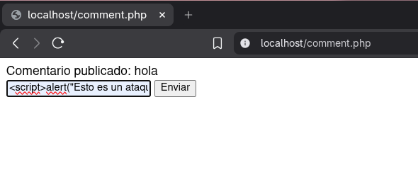
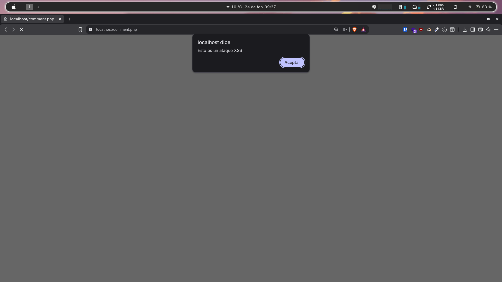
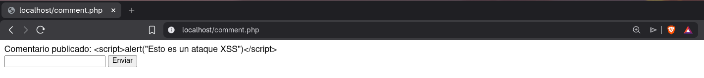

# Actividad: Vulnerabilidad OWASP Top 10 - Cross-Site Scripting (XSS)

Este documento detalla el proceso de explotación y posterior mitigación de una vulnerabilidad de tipo **Reflected XSS (Cross-Site Scripting)** en una aplicación web básica en PHP.

---

## Entorno de Laboratorio

El entorno se despliega utilizando Docker para aislar el servidor web.

### Archivo `docker-compose.yaml`

```yaml
version: '3.1'

services:
  server:
    image: php:apache
    ports:
      - 80:80
    volumes:
      - .:/var/www/html
```

Para levantar el entorno, ejecutamos el siguiente comando:

```bash
docker-compose up -d
```

---

## Fase 1: Explotación (El Ataque)

El archivo original `comment.php` contenía una vulnerabilidad crítica: tomaba la entrada del usuario a través del método POST (`$_POST['comment']`) y la imprimía directamente en el HTML usando `echo` sin ningún tipo de validación o sanitización.

### Preparación del Payload

Para demostrar la vulnerabilidad, se inyecta el siguiente script en el campo de texto del formulario:

```html
<script>alert("Esto es un ataque XSS")</script>
```




### Ejecución

Al enviar el formulario, el servidor refleja el código malicioso hacia el navegador del usuario. El navegador interpreta las etiquetas `<script>` y ejecuta el código JavaScript, demostrando que la vulnerabilidad existe.




---

## Fase 2: Mitigación (La Solución)

Para solventar esta vulnerabilidad, debemos asegurar que cualquier entrada del usuario sea tratada como texto plano y no como código ejecutable antes de ser renderizada en el navegador.


### Código Mitigado

Se ha modificado el archivo `comment.php` aplicando la función `htmlspecialchars()` de PHP. Se han añadido los parámetros `ENT_QUOTES` (para escapar tanto comillas simples como dobles) y `UTF-8` (para asegurar la correcta codificación de caracteres).

#### Archivo `comment.php` final

```php
<?php
if (isset($_POST['comment'])) {
    echo "Comentario publicado: " . htmlspecialchars($_POST['comment'], ENT_QUOTES, 'UTF-8');
}
?>
<form method="post">
    <input type="text" name="comment">
    <button type="submit">Enviar</button>
</form>
```

### Comprobación

Al intentar inyectar el mismo payload malicioso (`<script>alert("Esto es un ataque XSS")</script>`), el servidor ahora escapa los caracteres especiales (convirtiendo `<` en `&lt;` y `>` en `&gt;`).

El navegador renderiza el payload como texto inofensivo en la pantalla, evitando la ejecución del código y demostrando que la vulnerabilidad ha sido mitigada con éxito.

---

## Conclusión

La sanitización y el escapado de datos de salida (**Output Encoding**) son fundamentales para prevenir ataques de inyección, cumpliendo con las recomendaciones del estándar **OWASP Top 10**.
