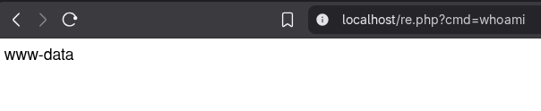
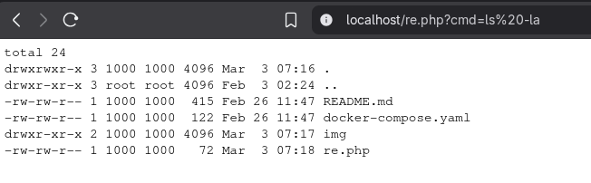
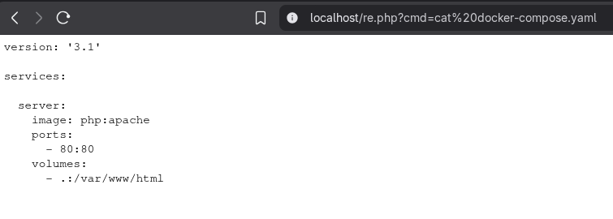
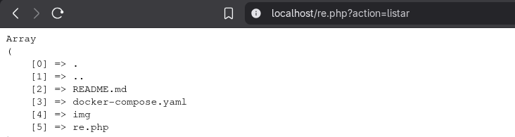
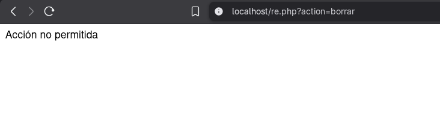

# Vulnerabilidad: Remote Code Execution (RCE)

Este documento detalla el análisis, explotación y mitigación de una vulnerabilidad de **Ejecución Remota de Código (RCE)** detectada en un entorno de laboratorio PHP.

## 1. Descripción del Problema

RCE (Remote Code Execution) es una vulnerabilidad crítica que ocurre cuando una aplicación permite ejecutar comandos en el sistema operativo del servidor sin las debidas restricciones. Esto suele suceder cuando se pasan datos proporcionados por el usuario directamente a funciones del sistema como `shell_exec`, `exec` o `system`.

**Impacto:**

* Acceso total al servidor web.
* Exfiltración de información sensible (configuraciones, contraseñas, código fuente).
* Posibilidad de escalada de privilegios o pivoteo a la red interna.

---

## 2. Análisis del Código Vulnerable

El script afectado (`re.php`) acepta un parámetro GET llamado `cmd` y lo pasa directamente a la función `shell_exec` sin ninguna validación o sanitización.

**Código vulnerable:**

```php
<?php
$output = shell_exec($_GET['cmd']);
echo $output;
?>
```

Como se observa, el código es extremadamente simple pero peligroso, actuando como una "webshell" rudimentaria.

---

## 3. Prueba de Concepto (PoC)

A continuación se documentan las fases de explotación para demostrar el impacto real de la vulnerabilidad.

### Fase 1: Verificación (Proof of Concept)

Para confirmar la ejecución de comandos, se inyecta el comando `whoami`. Esto revela el usuario bajo el cual corre el servicio web (generalmente `www-data`).

**Payload:** `?cmd=whoami`

**Resultado:** Ejecución exitosa.

### Fase 2: Reconocimiento (Enumeración)

Una vez confirmada la ejecución, se lista el contenido del directorio actual para identificar activos de valor.

**Payload:** `?cmd=ls -la`

**Resultado:** Se identifican archivos ocultos y de configuración, revelando la estructura del proyecto.

### Fase 3: Exfiltración de Información Sensible

Se identifica un archivo crítico (`docker-compose.yaml`) en el paso anterior y se procede a leer su contenido. En un entorno real, esto podría exponer credenciales de base de datos, claves de API o la arquitectura de red interna.

**Payload:** `?cmd=cat docker-compose.yaml`

**Resultado:** Acceso completo al archivo de configuración.

---

## 4. Mitigación y Solución

Para corregir esta vulnerabilidad, se deben eliminar las llamadas a comandos del sistema operativo. Las tareas como listar directorios o leer archivos deben realizarse con funciones nativas del lenguaje, que son mucho más seguras y limitadas al contexto de la aplicación web.

**Acciones realizadas:**

* Se eliminó `shell_exec`.
* Se implementó una lista blanca de acciones permitidas (si fuera necesario).
* Se utilizan funciones nativas de PHP.

### Código Mitigado

A continuación se muestra una versión corregida del código, donde ya no es posible inyectar comandos de sistema:

```php
<?php
$allowedActions = ['listar'];
$action = $_GET['action'] ?? '';

if (!in_array($action, $allowedActions, true)) {
    http_response_code(400);
    echo 'Acción no permitida';
    exit;
}

if ($action === 'listar') {
    $files = scandir(__DIR__);
    echo '<pre>' . htmlspecialchars(print_r($files, true)) . '</pre>';
}
?>
```

**Resultado:** La aplicación ya no ejecuta comandos del sistema y limita estrictamente las operaciones permitidas.



---


RCE (Remote Code Execution) ocurre cuando una aplicación permite ejecutar comandos en el sistema sin restricciones,
lo que puede dar control total al atacante en determinadas ocasiones.

Consecuencias de RCE:
- Acceso a información sensible (usuarios, archivos, configuración).
- Ejecución de comandos maliciosos (descarga y ejecución de malware).
- Escalada de privilegios y control total del sistema.
