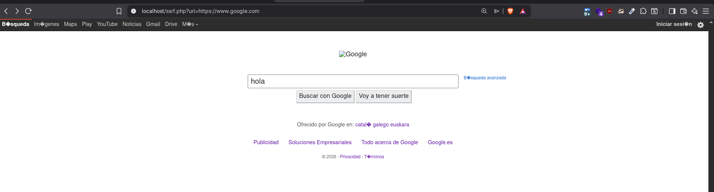
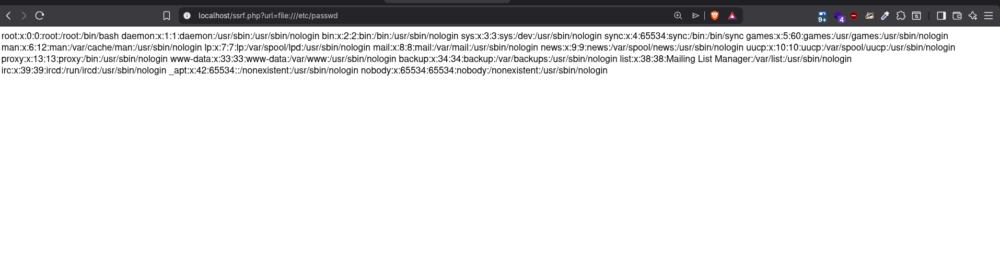
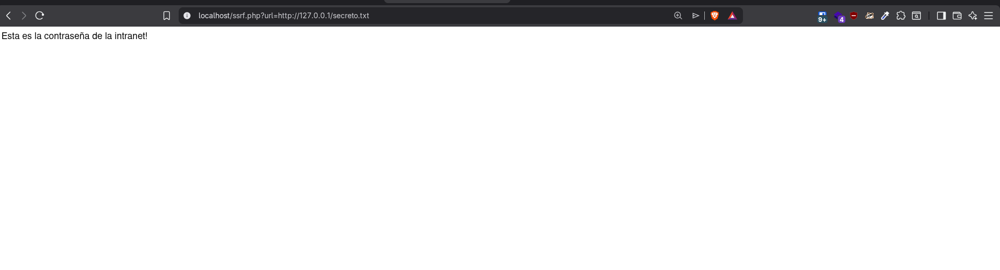
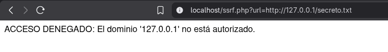

# Vulnerabilidad: Server-Side Request Forgery (SSRF)

Este documento detalla el análisis, explotación y mitigación de una vulnerabilidad **SSRF** detectada en el laboratorio.

---

## 1. ¿En qué consiste el ataque?

**SSRF (Server-Side Request Forgery)** es una vulnerabilidad que permite a un atacante inducir al servidor web a realizar peticiones HTTP (o de otros protocolos) hacia destinos arbitrarios elegidos por el atacante.

En un escenario normal, el servidor debería hablar solo con quien le contacta. En un ataque SSRF, obligamos al servidor a hablar con:

1. **Sistemas internos:** Servidores dentro de la misma red (Intranet) que no son accesibles desde internet.
2. **El propio servidor (localhost):** Para acceder a puertos de administración o bases de datos locales.
3. **El sistema de archivos:** Para leer archivos locales sensibles (como `/etc/passwd`).

El servidor actúa como un "proxy" involuntario, saltándose las reglas del Firewall perimetral.

---

## 2. Código Vulnerable

El script `ssrf.php` original utiliza la función `file_get_contents()` sin ninguna validación. Esta función es peligrosa porque acepta cualquier protocolo (HTTP, HTTPS, FTP, FILE...) y cualquier destino.

```php
<?php
$url = $_GET['url'];
// VULNERABLE: El servidor obedece ciegamente y trae lo que se le pida
$response = file_get_contents($url);
echo $response;
?>
```

---

## 3. Proceso de Explotación (PoC)

Hemos realizado tres pruebas para demostrar la gravedad del fallo.

### A. Prueba de Funcionamiento (Uso como Proxy)

Primero confirmamos que el script funciona y puede salir a internet. Le pedimos que visite Google por nosotros.

**Payload:**

```
?url=https://www.google.com
```

**Resultado:**

El servidor descarga y muestra la web de Google.



---

### B. Robo de Archivos Locales (Critical)

Aprovechamos que `file_get_contents` soporta el protocolo `file://` para leer archivos del sistema operativo del servidor, algo que un usuario web jamás debería poder hacer.

**Payload:**

```
?url=file:///etc/passwd
```

**Resultado:**

Obtenemos el listado de usuarios del sistema Linux.


---

### C. Acceso a la Red Interna (Intranet)

Simulamos el acceso a un recurso interno. Creamos un archivo `secreto.txt` en el servidor y accedemos a él a través de la interfaz de red local (`127.0.0.1`), simulando el acceso a una intranet corporativa.

**Payload:**

```
?url=http://127.0.0.1/secreto.txt
```

**Resultado:**

El servidor accede a su propio sistema de archivos vía web y nos muestra el secreto.


---

## 4. Mitigación y Solución

Para solucionar este problema, no basta con intentar filtrar la URL con expresiones regulares simples. Se ha implementado una defensa en profundidad con dos capas:

* **Lista Blanca (Allowlist):** Solo se permiten dominios explícitamente autorizados.
* **Uso de cURL con restricción de protocolos:** Se sustituye `file_get_contents` por la librería cURL, configurándola para que solo acepte HTTP/HTTPS, bloqueando físicamente el acceso a archivos locales (`file://`).

### Código Mitigado

```php
<?php
$url = $_GET['url'];

// 1. DEFINICIÓN DE LISTA BLANCA
// Solo permitimos el acceso a dominios de confianza.
$dominios_permitidos = ['google.com', 'wikipedia.org'];
$host_destino = parse_url($url, PHP_URL_HOST);

if (!in_array($host_destino, $dominios_permitidos)) {
    die("❌ ACCESO DENEGADO: Dominio no autorizado.");
}

// 2. USO SEGURO DE CURL
$ch = curl_init();
curl_setopt($ch, CURLOPT_URL, $url);
curl_setopt($ch, CURLOPT_RETURNTRANSFER, true);

// IMPORTANTE: Hardening de protocolos
// Esto asegura que, aunque alguien intente colar "file://", cURL lo rechazará.
curl_setopt($ch, CURLOPT_PROTOCOLS, CURLPROTO_HTTP | CURLPROTO_HTTPS);
curl_setopt($ch, CURLOPT_REDIR_PROTOCOLS, CURLPROTO_HTTP | CURLPROTO_HTTPS);

$response = curl_exec($ch);
curl_close($ch);

echo $response;
?>
```

---

## 5. Validación de la mitigación

Al intentar repetir el ataque de lectura de archivos o acceso a localhost, el sistema ahora bloquea la petición correctamente.



---

## 6. Recomendaciones adicionales

Para un hardening aún más robusto, se recomienda:

* Validar que la URL sea válida con `filter_var($url, FILTER_VALIDATE_URL)`.
* Resolver el dominio y bloquear rangos privados (127.0.0.0/8, 10.0.0.0/8, etc.).
* Deshabilitar redirecciones automáticas si no son necesarias.
* Implementar timeouts en cURL.
* Registrar intentos bloqueados para detección de ataques.

---
