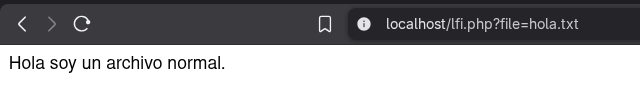
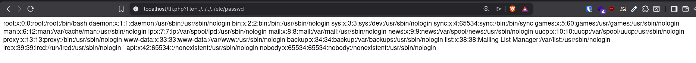
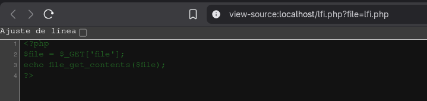
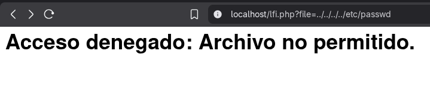

# Vulnerabilidad: Local File Inclusion (LFI)

Este documento detalla el análisis, explotación y mitigación de una vulnerabilidad **Local File Inclusion (LFI)** en un entorno web PHP.

---

## 1. ¿En qué consiste el ataque?

El **Local File Inclusion (LFI)** es una vulnerabilidad que ocurre cuando una aplicación web permite al usuario controlar el archivo que se va a incluir o leer en el servidor, sin la debida validación.

A través de técnicas como el **Path Traversal** (salto de directorios usando `../`), un atacante puede escapar del directorio público de la web y acceder a archivos confidenciales del sistema operativo, código fuente o archivos de configuración.

### Impacto

* **Lectura de archivos sensibles:** Acceso a contraseñas locales (ej. `/etc/passwd`).
* **Robo de código fuente:** Exposición de la lógica de la aplicación y credenciales de bases de datos.
* **Escalada a RCE:** Si se combina con la lectura de archivos de registro (Log Poisoning), puede derivar en una **Ejecución Remota de Código (RCE)**.

---

## 2. Análisis del Código Vulnerable

El script procesa un parámetro GET llamado `file` y lo pasa directamente a la función `file_get_contents()` sin ningún tipo de saneamiento.

### Código Vulnerable

```php
<?php
$file = $_GET['file'];
// VULNERABLE: El servidor lee y muestra cualquier ruta que el usuario envíe.
echo file_get_contents($file);
?>
```

---

## 3. Proceso de Explotación (PoC)

Para demostrar el impacto, se han realizado tres pruebas de escalada progresiva.

### Prueba A: Comprobación de la funcionalidad base

Primero confirmamos que el script funciona accediendo a un archivo de texto inofensivo en el mismo directorio.

**Payload:**

```
?file=hola.txt
```

**Resultado:**

El servidor devuelve el contenido del archivo legítimo.

---

### Prueba B: Path Traversal (Lectura de archivos del sistema)

Explotamos el LFI retrocediendo en la estructura de directorios (`../../../../`) hasta alcanzar la raíz del sistema de archivos Linux, para luego leer el archivo de usuarios.

**Payload:**

```
?file=../../../../etc/passwd
```

**Resultado:**

Exfiltración exitosa del archivo crítico `/etc/passwd`.

---

### Prueba C: Divulgación de Código Fuente

Utilizamos la vulnerabilidad para leer el propio código PHP de la aplicación. Al inspeccionar el código fuente de la respuesta en el navegador, revelamos la lógica interna del script.

**Payload:**

```
?file=lfi.php
```

**Resultado:**

Exposición del código backend.

---

## 4. Mitigación y Solución

Para neutralizar esta vulnerabilidad, debemos implementar un control estricto sobre lo que el usuario puede solicitar. Se ha aplicado una estrategia de **Defensa en Profundidad** combinando el saneamiento de la entrada y una lista blanca.



### Estrategias aplicadas

* **Saneamiento con `basename()`:** Se recorta cualquier ruta relativa (`../`) o absoluta, forzando a que la aplicación solo busque el nombre del archivo final en el directorio actual.
* **Lista Blanca (Allowlist):** Se define un array estricto con los únicos archivos que el sistema tiene permitido devolver.

### Código Mitigado

```php
<?php
$input_file = $_GET['file'];

// 1. SANEAMIENTO: Elimina saltos de directorio.
$safe_file = basename($input_file);

// 2. LISTA BLANCA: Archivos permitidos.
$archivos_permitidos = ['hola.txt', 'info.txt'];

// 3. VERIFICACIÓN: Solo se muestra si está en la lista.
if (in_array($safe_file, $archivos_permitidos)) {
    echo file_get_contents($safe_file);
} else {
    echo "<h1>Acceso denegado: Archivo no permitido.</h1>";
}
?>
```

## 5. Validación de la mitigación

Al intentar repetir los ataques anteriores (`../../../../etc/passwd` o `lfi.php`), el sistema rechaza la petición y bloquea el acceso.


